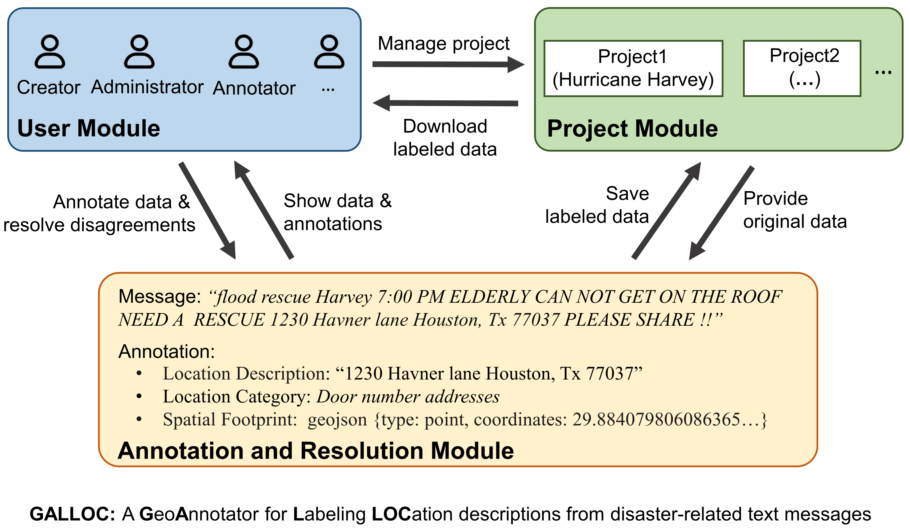

# GALLOC: a GeoAnnotator for Labeling LOCation descriptions from disaster-related text messages

## Overview
GALLOC is a GeoAnnotator for Labeling LOCation descriptions from disaster-related text messages. It is a Web-based and open-source platform that supports the creation of a dataset with labeled location descriptions, their categories, and spatial footprints. 
GALLOC consists of three major modules: 1) user module, 2) project module, and 3) annotation module. The overall architecture of GALLOC is shown in the following figure.

* The User Module supports the sign-up, login, and password changes of the users. Three roles are designed for the users: creator, administrator, and annotator. The creator role allows a user to create a project, edit project configurations (e.g., how many annotators are assigned to each text message), and resolve potential annotation disagreements from different users. The administrators are assigned by the creator and they share the same privileges as the creator. The annotator role only allows a user to make annotations. A user can concurrently be a creator, an administrator, and an annotator.
* The Project Module manages the creation, editing, and deleting of projects. A project can be created by specifying its project name, geographic scope, category schema, and number of annotators, batch size of messages, and uploading data to be annotated. A project can be edited and deleted by its creator and administrators. The annotated messages pertaining to a project can be compiled into a corpus which can then be downloaded. 
* The Annotation and Resolution Module supports the annotation of text messages and resolution of disagreements in annotations. An annotation can be made by selecting the location description in a message, specifying its category and spatial footprint.

## Repository resources and structure
This repository contains the source code of GALLOC and its user manual under permitted licenses. Specifically:
* The file GALLOC.rar contains the Java source code for implementing servlets and database operations in the server side and the HTML, Javascript, and css code for creating dynamic user interfaces in the client side.
* The file "User_Manual_GALLOC.pdf" is the user manual of GALLOC.
* The file "Test_corpus.txt" is an example corpus containing 100 social media messages that users can use to test the system.
* The file "GALLOC.war" is a war file which can be used for employing this tool on Tomcat.

## Deployment
Two ways can be used to deploy GALLOC:
1) Deploy GALLOC on Tomcat in local machine. To do this, please refer to the [Tomcat deployment guideline](Deployment.txt);
2) Package GALLOC into a Docker image and run it on Docker container. To do this. please refer to the [Docker deployment guideline](Deployment_docker.txt);

## Online demo
You can also use our [online demo](https://geoai.geog.buffalo.edu/GALLOC/) based on the user manual.

## Authors
* **Kai Sun** - *GeoAI Lab* - Email: ksun4@buffalo.edu
* **Yingjie Hu** - *GeoAI Lab* - Email: yhu42@buffalo.edu

## License

This project is licensed under the GNU GENERAL PUBLIC LICENSE 3.0 - see the [LICENSE](LICENSE) file for details.
