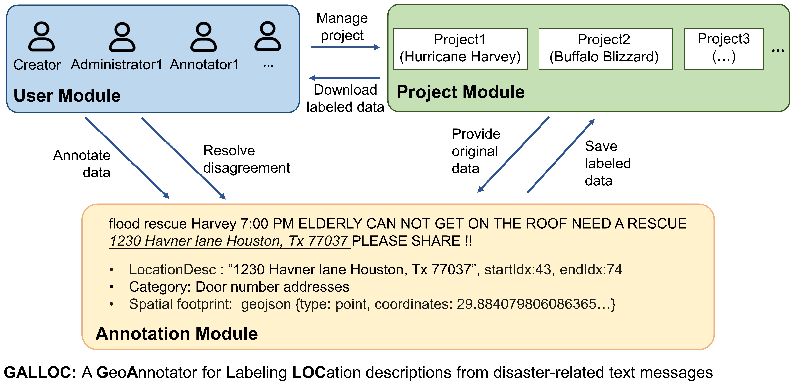

# GALLOC: a GeoAnnotator for Labeling LOCation descriptions from disaster-related text messages

## Overview
GALLOC is a GeoAnnotator for Labeling LOCation descriptions from disaster-related text messages. It is a Web-based and open-source platform that supports the creation of a dataset with labeled location descriptions, their categories, and spatial footprints. 
GALLOC consists of three major modules: 1) user module, 2) project module, and 3) annotation module. The overall architecture of GALLOC is shown in the following figure.

* The User Module supports the sign-up, login, and password changes of the users. Three roles are designed for the users: creator, administrator, and annotator. The creator role allows a user to create a project, edit project configurations (e.g., how many annotators are assigned to each text message), and resolve potential annotation disagreements from different users. The administrators are assigned by the creator and they share the same privileges as the creator. The annotator role only allows a user to make annotations. A user can concurrently be a creator, an administrator, and an annotator.
* The Project Module manages the creation, editing, and deleting of projects. A project can be created by specifying its project name, geographic scope, category schema, and number of annotators, batch size of messages, and uploading data to be annotated. A project can be edited and deleted by its creator and administrators. The annotated messages pertaining to a project can be compiled into a corpus which can then be downloaded. 
* The Annotation Module supports the annotation of text messages and resolution of disagreements in annotations. An annotation can be made by selecting the location description in a message, specifying its category and spatial footprint.

## Repository resources and structure
This repository contains the source code of GALLOC and its manual under permitted licenses.
The core code is in the folder "src/main". Specifically:
* The folder "src/main/java" contains the Java source code for implementing servlets and database operations in the server side;
* The folder "src/main/webapp" contains the HTML, Javascript, and css code for creating dynamic user interfaces in the client side.

## Deployment
You will need the following tools to deploy this project on your local machine.
* Java JDK 15
* Apache Tomcat 9.0
* SQLite3 database

Clone this GitHub project to your computer and follow the steps below.
#### Import GALLOC into an IDE 
GALLOC is implemented as a Java Web application using Eclipse IDE. You can import GALLOC into Eclipse, but you can also use other IDEs.

#### Test on the local server
Deploy GALLOC on a Tomcat server with your IDE and run index.html on the server;

Open http://localhost:8080/GALLOC/index.html on the browser to see GALLOC deployed on your local computer. If this page is successfully shown on the broswer, you have finished deploying GALLOC.

* Please feel free to reach us if you run into any issues in your deployment.

## Online demo
You can also use our [online demo](https://geoai.geog.buffalo.edu/GALLOC/) based on the manual.

## Authors
* **Kai Sun** - *GeoAI Lab* - Email: ksun4@buffalo.edu
* **Yingjie Hu** - *GeoAI Lab* - Email: yhu42@buffalo.edu

## License

This project is licensed under the GNU GENERAL PUBLIC LICENSE 3.0 - see the [LICENSE](LICENSE) file for details.